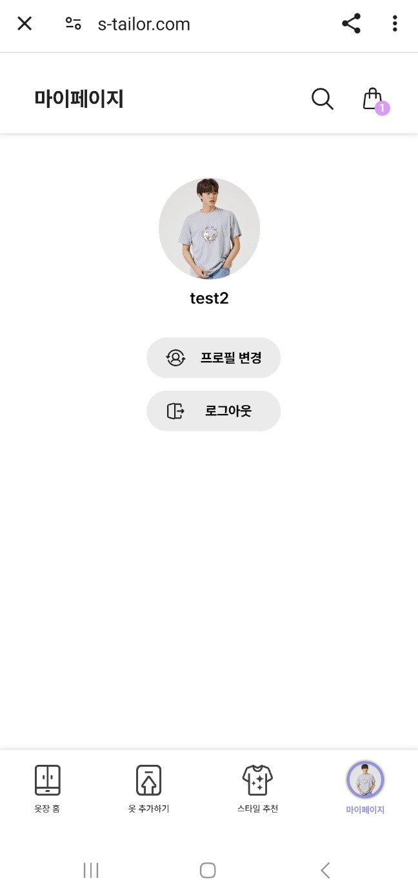

# SSAFY 10기 자율 프로젝트 

# S-Tailor

### 목차

[1. 프로젝트 개요](#1-프로젝트-개요)

[2. 팀 역할 소개](#2-팀-소개)

[3. 프로젝트 개발 환경](#3-프로젝트-개발-환경)

[4. 주요 기능 소개](#4-주요-기능-소개)

[5. 서비스 화면](#5-서비스-화면)

## 1. 프로젝트 개요

<b>S-Tailor</b>

    직접 옷을 입어보지 않아도 모바일과 키오스크 환경에서 사용자가 가상으로 옷을 입어볼 수 있는 서비스

## 2. 팀 역할 소개

    이지은 : Leader, FrontEnd, Interface, Presentation 

    나하나 : FrontEnd, Design, PPT

    조상민 : FrontEnd, Interface, UCC, API연결

    김재민 : BackEnd, Infra

    이수형 : BackEnd, AI

    장선웅 : BackEnd, Cloud

## 3. 프로젝트 개발 환경

<h3>3-1. FrontEnd</h3>

```
Node 20.11.1-Alpine
React 18.2.0
TypeScript 5.2.2
Zustand 4.5.2
```

<h3>3-2. BackEnd</h3>

```
1. Spring
    Java 17
    Spring Boot 2.4.5
    JPA
    JWT 3.10.3
    RestTemplate 3.0.0

2. FastAPI
    Python 3.10
    Uvicorn
    PyTorch
```

<h3>3-3. Infra</h3>

```
Docker Compose 3
Google Cloud Platform
Jenkins
Nginx
Certbot
EC2
S3
RDS
DynamoDB
Lambda
Bedrock
CloudFront
API Gateway
```

## 4. 주요 기능

1. 옷장

   - 사용자가 추가한 옷들을 전체 확인 가능
   - 사용자가 추가했던 옷들을 카테고리 별로 나눠서 학인 기능

2. 옷 추가

   - 텍스트로 상품 검색 기능
   - 사진/저장된 이미지로 상품 검색 기능
   - 옷 선택 시 자동으로 카테고리 지정

3. 위시리스트

   - 옷장에 있는 옷을 위시리스트에 저장
   - 위시리스트에서 바로 구매사이트로 이동 가능

4. 챗봇

   - 패션/옷에 대한 조언 기능
     - 텍스트로 대화 가능
     - 이미지 + 텍스트로 대화 가능
   - 옷 추천 기능

5. 가상 시착

   - 옷장에 저장된 옷을 사진/저장된 이미지로 시착 가능
     - 상의, 하의, 전신 적용 가능

6. 마이페이지

   - 프로필 변경 기능
   - 로그아웃 기능

7. 연동
   - 모바일과 키오스크 연동 기능
   - 연동된 기기끼리만 소통 가능

## 5. 서비스 화면

 
 
 
 

## 6.시스템 아키텍쳐

 
 
